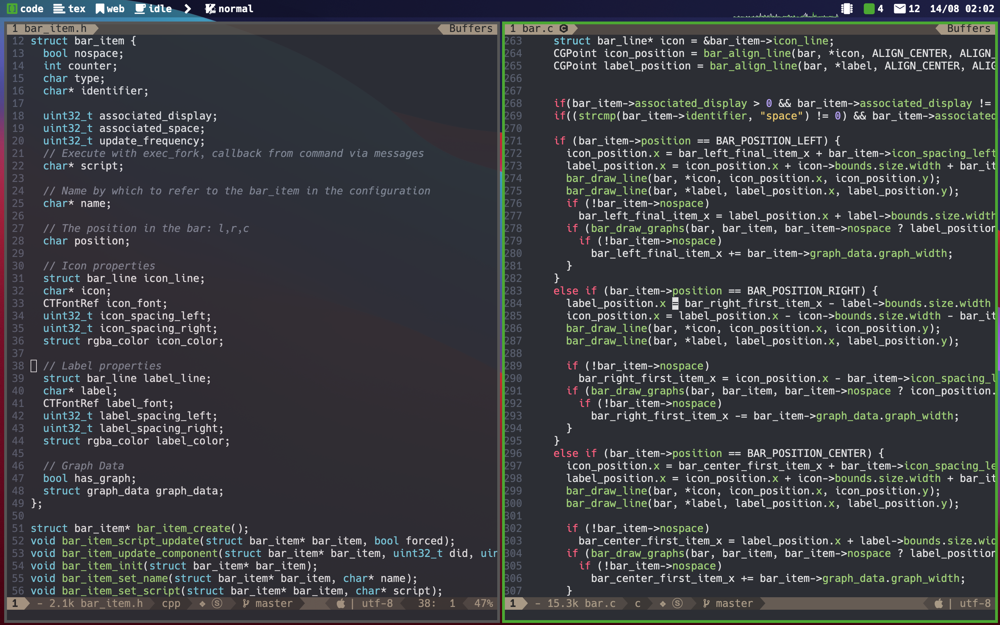

# SketchyBar
This is a rewrite of the spacebar project, which itself is a rewrite of the statusbar code from yabai.
What I have added:
* As many widgets as you like at any of the three positions: left, center, right
* The order of the widgets in the sketchybarrc file will be the order in which they show in the bar
* Associate widgets to certain displays or spaces, to show specific information on the relevant screens/displays
* The widgets are highly customizable with settings for different fonts, colors, icon paddings, label paddings, etc. for each individual element
* Relocate *all* visible components of the bar (even spaces or the window title, etc.)
* Draw arbitrary graphs in the bar with external data provider scripts that push the data into the graph
* Overlay as many graphs as wanted, like system cpu usage and user cpu usage in one figure
* Individual refresh frequencies for each widget
* ... feel free to explore my sketchybarrc file for more details on the options

This is my setup:

where I have my screens and a vim mode indicator on the left. Not shown is the high memory warning which shows the process that is using high system memory on demand.
In the center I have a spotify indicator (only when music is playing) and on the right I have (not shown) a high cpu process indicator, as well as a cpu graph, a github contribution counter, a new mail counter and the current date.

The cpu and memory indicators are only shown on the "code" screen and are not visible on the other screens.

## Installation
Clone the repo and run 
```bash
make install
ln ./bin/sketchybar /usr/local/bin/sketchybar
```
Now you can create you configuration inside of $HOME/.config/sketchybar/sketchybarrc
and finally run the bar via
```bash
sketchybar
```


Credits:
yabai,
spacebar,
reddit,
many more for the great code base and inspiration
