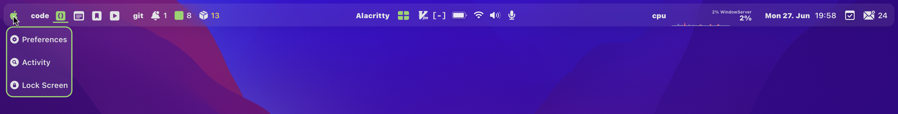

<p align="center">
  
</p>

<p align="center">
<a href="https://opensource.org/licenses/"></a>
<a href="https://github.com/FelixKratz/SketchyBar/releases"></a>
<a href="https://github.com/FelixKratz/SketchyBar/releases"></a>
<a href="https://en.wikipedia.org/wiki/Free_and_open-source_software"></a>
</p>

<p align="center">
This bar project aims to create a highly flexible, customizable, fast and powerful status bar replacement for users that like playing around with
shell scripts.
</p>


<p align="center">
More example setups <a href="https://github.com/FelixKratz/SketchyBar/discussions/47">here</a>.
</p>

Table of Contents
=================

* [Table of Contents](#table-of-contents)
   * [Features](#features)
   * [Installation](#installation)
      * [Stable Version](#stable-version)
      * [Plugins and Fonts](#plugins-and-fonts)
   * [Global configuration of the bar](#global-configuration-of-the-bar)
   * [Items and their properties](#items-and-their-properties)
      * [Adding items to sketchybar](#adding-items-to-sketchybar)
      * [Changing item properties](#changing-item-properties)
      * [Changing the default values for all further items](#changing-the-default-values-for-all-further-items)
   * [Components -- Special Items with special properties](#components----special-items-with-special-properties)
      * [Data Graph -- Draws an arbitrary graph into the bar](#data-graph----draws-an-arbitrary-graph-into-the-bar)
      * [Space -- Associate mission control spaces with an item](#space----associate-mission-control-spaces-with-an-item)
      * [Item Bracket -- Group Items in e.g. colored sections](#item-bracket----group-items-in-eg-colored-sections)
      * [Item Alias -- Mirror items of the original macOS status bar into sketchybar](#item-alias----mirror-items-of-the-original-macos-status-bar-into-sketchybar)
   * [Popup Menus](#popup-menus)
   * [Batching of configuration commands](#batching-of-configuration-commands)
   * [Events and Scripting](#events-and-scripting)
      * [Creating custom events](#creating-custom-events)
      * [Triggering custom events](#triggering-custom-events)
      * [Forcing all shell scripts to run and the bar to refresh](#forcing-all-shell-scripts-to-run-and-the-bar-to-refresh)
   * [Querying](#querying)
      * [Bar Properties](#bar-properties)
      * [Item Properties](#item-properties)
      * [Default Properties](#default-properties)
      * [Event Properties](#event-properties)
   * [Item Reordering](#item-reordering)
   * [Moving Items to specific positions](#moving-items-to-specific-positions)
   * [Item Cloning](#item-cloning)
   * [Renaming Items](#renaming-items)
   * [Removing Items](#removing-items)
   * [Performance optimizations](#performance-optimizations)
   * [Credits](#credits)

## Features

* Performance friendly
* No accessibility permissions needed
* Fully scriptable
* Highly configurable
* Supports drawing native macOS menu bar applications
* Powerful event system (items can subscribe to many system events)
* Popup Menus
* Mouse Support
* Many visual features
* Support for graphs
* Per display and per space individualization

The configuration of the bar takes place in a confiuration file where almost everything can be configured.
Basically, the bar itself is a rectangle that can hold arbitrarily many *items*, which can be configured to do awesome stuff.
An *item* will occupy a space in the bar and can be equipped to show an *icon* and a *label*. The *icon* and *label* can be changed through
*scripts* that can be attached to the *item*. It is also possible to *subscribe* an *item* to certain *events* for their *script* execution action,
which makes very powerful items possible.
Furthermore, an *item* can be assigned to mission control spaces or displays, such that they only show on a certain space or display, which makes multi-desktop configuration
of the bar possible and opens the possibility to create individualized bar configuration on a per display and per space level.
These simple ingredients make *items* almost endlessly customizable and can be used to display arbitrary information and perform useful actions. For some examples see my sketchybarrc and
the plugins folder.

Some special features can not be accomplished with a simple *item*, this is where the *components* come into play. They basically are *items* with
extra steps. They contain all the properties a regular item does, but they can do specialized tasks a simple item can not. For example, there
is a *graph* component, which can be used to display graphs in the bar.

For more details on how the configuration works, see the configuration section below.

## Installation
### Stable Version
```bash
brew tap FelixKratz/formulae
brew install sketchybar
```
Do not forget to copy the example configuration files to your home directory (the brew installation specific commands are listed in the caveats section after the brew install is finished).

Run the bar via
```bash
brew services start sketchybar
```

### Plugins and Fonts
When you use additional plugins, make sure that they are referenced in the rc with the correct path and that they are made executable via
```bash
chmod +x name/of/plugin.sh
```
The default plugin folder is located in `~/.config/sketchybar/plugins`.
All plugins must work with absolute paths because relative paths will not be resolved correctly.
Have a look at the [discussion](https://github.com/FelixKratz/SketchyBar/discussions/12) about plugins and share your own if you want to.
You should of course vet the code from all plugins before executing them to make sure they are not harming your computer.

If you have problems with missing fonts you might need to install the Hack Nerd Font:
```bash
brew tap homebrew/cask-fonts
brew install --cask font-hack-nerd-font
```

## Global configuration of the bar
For an example configuration see the supplied default *sketchybarrc*. The configuration file resides in `~/.config/sketchybar/`, where everything can be freely configured. It is also possible to play around with properties in a terminal and change them while the bar is running, once you find a fitting value you can include it in the `sketchybarrc` file such that the configuration is restored on restart. The global bar properties can be configured by invoking:
```bash
sketchybar --bar <setting>=<value> ... <setting>=<value>
```

where possible settings are:

| \<setting\>      | \<value\>            | default      | description                                                 |
| :-------:        | :------:             | :-------:    | -----------                                                 |
| `color`          | `<argb_hex>`         | `0x44000000` | Color of the bar                                            |
| `border_color`   | `<argb_hex>`         | `0xffff0000` | Color of the bars border                                    |
| `position`       | `top`, `bottom`      | `top`        | Position of the bar on the screen                           |
| `height`         | `<integer>`          | `25`         | Height of the bar                                           |
| `margin`         | `<integer>`          | `0`          | Margin around the bar                                       |
| `y_offset`       | `<integer>`          | `0`          | Vertical offset of the bar from its default position        |
| `corner_radius`  | `<positive_integer>` | `0`          | Corner radius of the bar                                    |
| `border_width`   | `<positive_integer>` | `0`          | Border width of the bars border                             |
| `blur_radius`    | `<positive_integer>` | `0`          | Blur radius applied to the background of the bar            |
| `padding_left`   | `<positive_integer>` | `0`          | Padding between the left bar border and the leftmost item   |
| `padding_right`  | `<positive_integer>` | `0`          | Padding between the right bar border and the rightmost item |
| `display`        | `main`, `all`        | `all`        | Display to show the bar on                                  |
| `hidden`         | `<boolean>`          | `off`        | If the bar is hidden                                        |
| `topmost`        | `<boolean>`          | `off`        | If the bar should be drawn on top of `everything`           |
| `font_smoothing` | `<boolean>`          | `off`        | If fonts should be smoothened                               |
| `shadow`         | `<boolean>`          | `off`        | If the bar should draw a shadow                             |

## Items and their properties
Items are the main building blocks of sketchybar and can be configured in a number of ways. Items have the following basic structure: <br>
 <br>

### Adding items to sketchybar
```bash
sketchybar --add item <name> <position>
```
where the `<name>` should not contain whitespaces (or must be quoted), it can be used to further configure the item.
The `<position>` is the placement in the bar and can be either *left*, *right* or *center*. The items will appear in the bar in the order
in which they are added, but can be moved later on.

| `<name>`     | `<string>`                                                                                        |
| -----        | ---------                                                                                         |
| `<position>` | `left`, `right`, `center`, (`q`, `e` [#120](https://github.com/FelixKratz/SketchyBar/issues/120)) |

### Changing item properties
```bash
sketchybar --set <name> <property>=<value> ... <property>=<value>
```
where the *name* is used to target the item with this name.
(The *name* can be a regular expression inside of two '/': */\<regex\>/*)

A list of properties available to the *set* command is listed below (components might have additional properties, see the respective component section for them):

* Geometry Properties:

| \<property\>         | \<value\>                         | default   | description                                                                                          |
| :-------:            | :------:                          | :-------: | -----------                                                                                          |
| `position`           | `left`, `right`, `center`         |           | Position of the item in the bar                                                                      |
| `associated_space`   | `<positive_integer list>`         | `0`       | Spaces to show this item on                                                                          |
| `associated_display` | `<positive_integer list>`         | `0`       | Displays to show this item on                                                                        |
| `y_offset`           | `<integer>`                       | `0`       | Vertical offset applied to the `text`                                                                |
| `width`              | `<positive_integer>` or `dynamic` | `dynamic` | Makes the *item* use a fixed *width* given in points                                                 |
| `align`              | `center`, `left`, `right`         | `left`    | Aligns the `item` content in its container when it has a fixed `width` larger than the content width |

* Drawing properties:

| \<property\> | \<value\>   | default   | description                                                                                   |
| :-------:    | :------:    | :-------: | -----------                                                                                   |
| `drawing`    | `<boolean>`   | `on`      | If the item should be drawn into the bar                                                      |
| `lazy`       | `<boolean>` | `off`     | Changes do not trigger a redraw of the bar, item is refreshed when the bar is redrawn anyways |

* Icon properties:

| \<property\>           | \<value\>  | default   | description                         |
| :-------:              | :------:   | :-------: | -----------                         |
| `icon`                 | `<string>` |           | Icon of the item                    |
| `icon.<text_property>` |            |           | Icons support all *text* properties |

* Label properties:

| \<property\>            | \<value\>  | default   | description                          |
| :-------:               | :------:   | :-------: | -----------                          |
| `label`                 | `<string>` |           | Label of the item                    |
| `label.<text_property>` |            |           | Labels support all *text* properties |

* Scripting properties:

| \<property\>    | \<value\>                 | default   | description                                                                                                                            |
| :-------:       | :------:                  | :-------: | -----------                                                                                                                            |
| `script`        | `<path>`, `<string>`      |           | Script to run on an `event` (All scripts *must* include a shebang                                                                      |
| `click_script`  | `<path>`, `<string>`      |           | Script to run on a mouse click (Difference to `mouse.clicked` event: [#109](https://github.com/FelixKratz/SketchyBar/discussions/109)) |
| `update_freq`   | `<positive_integer>`      | `1`       | Time in seconds between routine script executions                                                                                      |
| `updates`       | `<boolean>`, `when_shown` | `on`      | If and when the item updates e.g. via script execution                                                                                 |

* Text properties:

| \<text_property\>                  | \<value\>                         | default      | description                                                                                  |
| :-------:                          | :------:                          | :-------:    | -----------                                                                                  |
| `drawing`                          | `<boolean>`                       | `on`         | If the text is rendered                                                                      |
| `highlight`                        | `<boolean>`                       | `off`        | If the text uses the `highlight_color` or the regular `color`                                |
| `color`                            | `<argb_hex>`                      | `0xffffffff` | Color used to render the text                                                                |
| `highlight_color`                  | `<argb_hex>`                      | `0xff000000` | Highlight color of the text (e.g. for active space icon                                      |
| `padding_left`                     | `<integer>`                       | `0`          | Padding to the left of the `text`                                                            |
| `padding_right`                    | `<integer>`                       | `0`          | Padding to the right of the `text`                                                           |
| `y_offset`                         | `<integer>`                       | `0`          | Vertical offset applied to the `text`                                                        |
| `width`                            | `<positive_integer>` or `dynamic` | `dynamic`    | Makes the `text` use a fixed `width` given in points                                         |
| `align`                            | `center`, `left`, `right`         | `left`       | Aligns the `text` in its container when it has a fixed `width` larger than the content width |
| `background.<background_property>` |                                   |              | Texts support all `background` properties                                                    |
| `shadow.<shadow_property>`         |                                   |              | Texts support all `shadow` properties                                                        |

* Background properties:

| \<background_property\>    | \<value\>            | default      | description                                 |
| :-------:                  | :------:             | :-------:    | -----------                                 |
| `drawing`                  | `<boolean>`          | `off`        | If the `background` should be rendered      |
| `color`                    | `<argb_hex>`         | `0x00000000` | Fill color of the `background`              |
| `border_color`             | `<argb_hex>`         | `0x00000000` | Color of the backgrounds border             |
| `border_width`             | `<positive_integer>` | `0`          | Width of the background border              |
| `height`                   | `<positive_integer>` | `0`          | Overrides the `height` of the background    |
| `corner_radius`            | `<positive_integer>` | `0`          | Corner radius of the background             |
| `padding_left`             | `<integer>`          | `0`          | Padding to the left of the `background`     |
| `padding_right`            | `<integer>`          | `0`          | Padding to the right of the `background`    |
| `y_offset`                 | `<integer>`          | `0`          | Vertical offset applied to the `background` |
| `shadow.<shadow_property>` |                      |              | Backgrounds support all `shadow` properties |
| `image.<image_property>`   |                      |              | Backgrounds support all `image` properties  |

* Shadow properties:

| \<shadow_property\> | \<value\>            | default    | description                   |
| :-------:           | :------:             | :-------:  | -----------                   |
| `shadow.drawing`    | `<boolean>`          | `off`      | If the shadow should be drawn |
| `shadow.color`      | `<argb_hex>`         | 0xff000000 | Color of the shadow           |
| `shadow.angle`      | `<positive_integer>` | 30         | Angle of the shadow           |
| `shadow.distance`   | `<positive_integer>` | 5          | Distance of the shadow        |

* Image properties (Can be resource intensive if many large images are drawn):

| \<image_property\> | \<value\>                                            | default              | description |
| :-------:          | :------:                                             | :-------:            | ----------- |
| `image`            | The path to a png or jpeg image file                 | `<path>`             |             |
| `image.drawing`    | If the image should draw                             | `<boolean>`          | `off`       |
| `image.scale`      | The scale factor that should be applied to the image | `<positive_integer>` | `0`         |

### Changing the default values for all further items
It is possible to change the *defaults* at every point in the configuration. All item created *after* changing the defaults will
inherit these properties from the default item.

```bash
sketchybar --default <property>=<value> ... <property>=<value>
```
this works for all item properties.

It is also possible to reset the defaults via the command
```bash
sketchybar --default reset
```

### Type nomenclature

| `type`                    | `values`                                                         |
| -----                     | ---------                                                        |
| `<boolean>`               | `on`, `off`, `yes`, `no`, `true`, `false`, `1`, `0`, `toggle`    |
| `<argb_hex>`              | Color as an 8 digit hex with alpha, red, green and blue channels |
| `<path>`                  | An absolute file path                                            |
| `<string>`                | Any UTF-8 string or symbol                                       |
| `<integer>`               | An integer                                                       |
| `<positive_integer>`      | A positive integer                                               |
| `<positive_integer list>` | A comma separated list of positive integers                      |

## Components -- Special Items with special properties
Components are essentially items, but with special properties.
Currently there are the components (more details in the corresponding sections below):
* *graph*: showing a graph,
* *space*: representing a mission control space
* *bracket*: brackets together other items
* *alias*: a default menu bar item

### Data Graph -- Draws an arbitrary graph into the bar
```bash
sketchybar --add graph <name> <position> <width in points>
```

Additional graph properties:
* *graph.color*: color of the associated graph
* *graph.fill_color*: optional property to override the automatically calculated fill color of the graph
* *graph.line_width*: sets the line width of the associated graph

Push data points into the graph via:
```bash
sketchybar --push <name> <data point>
```

### Space -- Associate mission control spaces with an item
```bash
sketchybar --add space <name> <position>
```
The space component overrides the definition of the following properties and they must be set to correctly associate a mission control space with this item:
* *associated_space*: Which space this item represents
* *associated_display*: On which display the *associated_space* is shown.
The space component has additional variables available in *scripts*:
```bash
$SELECTED
$SID
$DID
```
where *$SELECTED* has the value *true* if the associated space is selected and *false* if the selected space is not selected, while
`$SID` holds the space id and `$DID` the display id.

By default the space component invokes the following script:
```bash
sketchybar --set $NAME icon.highlight=$SELECTED
```
which you can freely configure to your liking by supplying a different script to the space component:
```bash
sketchybar --set <name> script=<script/path>
```

For performance reasons the space script is only run on change.

### Item Bracket -- Group Items in e.g. colored sections
It is possible to bracket together items via the command (see [this](https://github.com/FelixKratz/SketchyBar/discussions/12#discussioncomment-1455842) discussion for an example):
```bash
sketchybar --add bracket <name> <first item name> ... <n-th item name>
```
The first item must always be the one listed earliest in the config. It is now possible to
set properties for the bracket, just as for any item or component. Brackets currently only support all background features.
E.g., if I wanted a colored background around *all* my space components (which are named *code*, *writing*, *reading* and *entertainment*) I would set it up like this:
```bash
sketchybar --add bracket primary_spaces code                        \
                                        writing                     \
                                        reading                     \
                                        entertainment               \
                                                                    \
           --set         primary_spaces background.color=0xffffffff \
                                        background.corner_radius=4  \
                                        background.height=20
```
this draws a white background below all my space components. I plan to expand the capability of item brackets significantly in the future.

### Item Alias -- Mirror items of the original macOS status bar into sketchybar
It is possible to create an alias for default menu bar items (such as MeetingBar, etc.) in sketchybar. The default menu bar can be set to autohide and this should still work.

Important: <br>
I highly recommend setting a wallpaper on all spaces that makes the default menu bar items appear in either the light or the dark theme consitently.

It is now possible to create an alias of a default menu bar item with the following syntax:
```bash
sketchybar --add alias <application_name> <position>
```
this operation requires *screen capture permissions*, which should be granted in the system preferences.
This will put the default item into sketchybar. 
Aliases currently are not clickable but can be modified with all the options available for simple items.

The command can be overloaded by providing a *window_owner* and a *window_name*
```bash
sketchybar --add alias <window_owner>,<window_name> <position>
```
this way the default system items can also be slurped into sketchybar, e.g.: <br>
"Control Center,Bluetooth" <br>
"Control Center,WiFi" <br>

Or the individual widgets of [Stats](https://github.com/exelban/stats):<br>
"Stats,CPU_Mini"<br>
etc...<br>

All further default menu items currently available on your system can be found via the command:
```bash
sketchybar --query default_menu_items
```

## Popup Menus
 <br>
Popup menus are a powerful way to make further `items` accessible in a small popup window below any bar item.
Every item has a popup available with the properties:
* *popup.background.\<property\>*: All background properties are available for the popup
* *popup.align*: Where to align the popup below the item (values: *left*, *right*, *center*, default: *left*)
* *popup.horizontal*: If the popup should draw horizontally, by default popups will draw vertically (values: *on*, *off*, *toggle*, default: *off*)
* *popup.drawing*: If the popup should draw (values: *on*, *off*, *toggle*, default: *off*)
* *popup.y_offset*: The vertical offset for the popup anchor (default: 0)

Items can be added to a popup menu by setting the `position` of those items to `popup.<name>` where <name> is the name of the item containing the popup.
You can find a demo implementation of this [here](https://github.com/FelixKratz/SketchyBar/discussions/12?sort=new#discussioncomment-1843975).

## Batching of configuration commands
It is possible to batch commands together into a single call to sketchybar, this can be helpful to
keep the configuration file a bit cleaner and also to reduce startup times.
Assume 5 individual configuration calls to sketchybar:
```bash
sketchybar --bar position=top
sketchybar --bar margin=5
sketchybar --add item demo left
sketchybar --set demo label=Hello
sketchybar --subscribe demo system_woke
```
after each configuration command the bar is redrawn (if needed), thus it is more perfomant to append these calls into a single command like so:
```bash
sketchybar --bar position=top           \
                 margin=5               \
           --add item demo left         \
           --set demo label=Hello       \
           --subscribe demo system_woke
```
The backslash at the end of the first 4 lines is the default bash way to join lines together and should not be followed by a whitespace.  

## Events and Scripting
Any item can *subscribe* to arbitrary *events*, when the *event* happens, all items subscribed to the *event* will execute their *script*.
This can be used to create more reactive and performant items which react to events rather than polling for a change.
```bash
sketchybar --subscribe <name> <event> ... <event>
```
where the events are:
* *front_app_switched*: when the frontmost application changes (not triggered if a different app of the same window is focused)
* *space_change*: when the space is changed
* *display_change*: when the display is changed
* *system_will_sleep*: when the system is preparing to sleep
* *system_woke*: when the system has awaken from sleep
* *mouse.entered*: when the mouse enters over an item
* *mouse.exited*: when the mouse leaves an item
* *mouse.clicked*: when an item is clicked

When an item is subscribed to these events the *script* is run and it gets passed the `$SENDER` variable, which holds exactly the above names, to distinguish between the different events.
It is thus possible to have a script that reacts to each event differently e.g. via a switch for the `$SENDER` variable in the *script*.

Alternatively a fixed *update_freq* can be *--set*, such that the event is routinely run to poll for change.

When an item invokes a script, the script has access to some environment variables, such as:
```bash
$NAME
$SENDER
```
Where `$NAME` is the name of the item that has invoked the script and `$SENDER` is the reason why the script is executed.

If an item is *clicked* the script has access to the additional variables:
```bash 
$BUTTON
$MODIFIER
```
where the `$BUTTON` can be *left*, *right* or *other* and specifies the mouse button that was used to click the item, while the `$MODIFIER` is either *shift*, *ctrl*, *alt* or *cmd* and 
specifies the modifier key held down while clicking the item.

Some events send additional information in the `$INFO` variable

All scripts are forced to terminate after 60 seconds and do not run while the system is sleeping. 

### Creating custom events
This allows to define events which are triggered by a different application (see Trigger custom events). Items can also subscribe to these events for their script execution.
```bash
sketchybar --add event <name> [optional: <NSDistributedNotificationName>]
```
Optional: You can subscribe to the notifications sent to the NSDistributedNotificationCenter e.g.
the notification Spotify sends on track change: *com.spotify.client.PlaybackStateChanged* ([example](https://github.com/FelixKratz/SketchyBar/discussions/12#discussioncomment-1455842)), or the
notification sent by the system when a bluetooth device connected, or disconnected: *com.apple.bluetooth.state* ([example](https://github.com/FelixKratz/SketchyBar/discussions/12#discussioncomment-1465761))
to create more responsive items. Custom events that subscribe to NSDistributedNotificationCenter notifications will receive additional notification information in the `$INFO` variable if available.

### Triggering custom events
This triggers a custom event that has been added before
```bash
sketchybar --trigger <event> [Optional: <envvar>=<value> ... <envvar>=<value>]
```
Optionaly you can add environment variables to the trigger command witch are passed to the script, e.g.:
```bash
sketchybar --trigger demo VAR=Test
```
will trigger the demo event and `$VAR` will be available as an environment variable in the scripts that this event invokes.
This could be used to link the powerful event system of yabai to sketchybar by triggering the custom action via a yabai event.


### Forcing all shell scripts to run and the bar to refresh
```bash
sketchybar --update
```

## Querying
*SketchyBar* can be queried for information about a number of things.
### Bar Properties
Information about the bar can be queried via:
```bash
sketchybar --query bar
```
The output is a json structure containing relevant information about the configuration settings of the bar.
### Item Properties
Information about an item can be queried via:
```bash
sketchybar --query <name>
```
The output is a json structure containing relevant information about the configuration of the item.
### Default Properties
Information about the current defaults.
```bash
sketchybar --query defaults
```
### Event Properties
Information about the events.
```bash
sketchybar --query events
```

## Item Reordering
It is possible to reorder items by invoking
```bash 
sketchybar --reorder <name> ... <name>
```
where a new order can be supplied for arbitrary items. Only the specified items get reordered, by swapping them around, everything else stays the same. E.g. if you want to swap two items 
simply call
```bash 
sketchybar --reorder <item 1> <item 2>
```
## Moving Items to specific positions
It is possible to move items and order them next to a reference item. <br>
Move Item *<name>* to appear *before* item *<reference name>*:
```bash 
sketchybar --move <name> before <reference name>
```
Move Item *<name>* to appear *after* item *<reference name>*:
```bash 
sketchybar --move <name> after <reference name>
```
## Item Cloning
It is possible to clone another item instead of adding a completely blank item
```bash 
sketchybar --clone <name> <parent name> [optional: before/after]
```
the new item will inherit *all* properties of the parent item. The optional *before* and *after* modifiers can be used
to move the item *before*, or *after* the parent, equivalently to a --move command.
## Renaming Items
It is possible to rename any item. The new name should obviously not be in use by another item:
```bash 
sketchybar --rename <old name> <new name>
```
## Removing Items
It is possible to remove any item by invoking, the item will be completely destroyed and removed from brackets 
```bash 
sketchybar --remove <name>
```
the `<name>` can again be a regex: `/<regex>/`.

## Performance optimizations
*SketchyBar* can be configured to have a *very* small performance footprint. In the following I will highlight some optimizations that can be used to reduce the footprint further. 

* Batch together configuration commands where ever possible.
* Set items to be *lazy*, e.g. I have an alias component in my bar that updates every *2* seconds, thus I set all *non-reactive* items to *lazy=on*, 
and only the ones that should react to change instantaneously to *lazy=off*.
* Set *updates=when_shown* for items that do not need to run their script if they are not rendered.
* Reduce the *update_freq* of *scripts* and *aliases* and use event-driven scripting when ever possible.
* Do not add *aliases* to apps that are not always running, otherwise sketchybar searches for them continously.

## Credits
This project was forked from *[spacebar](https://github.com/cmacrae/spacebar)* and completely reimagined and rewritten. <br>
The original idea is based on the status bar that was included in *[yabai](https://github.com/koekeishiya/yabai)* before getting removed.
