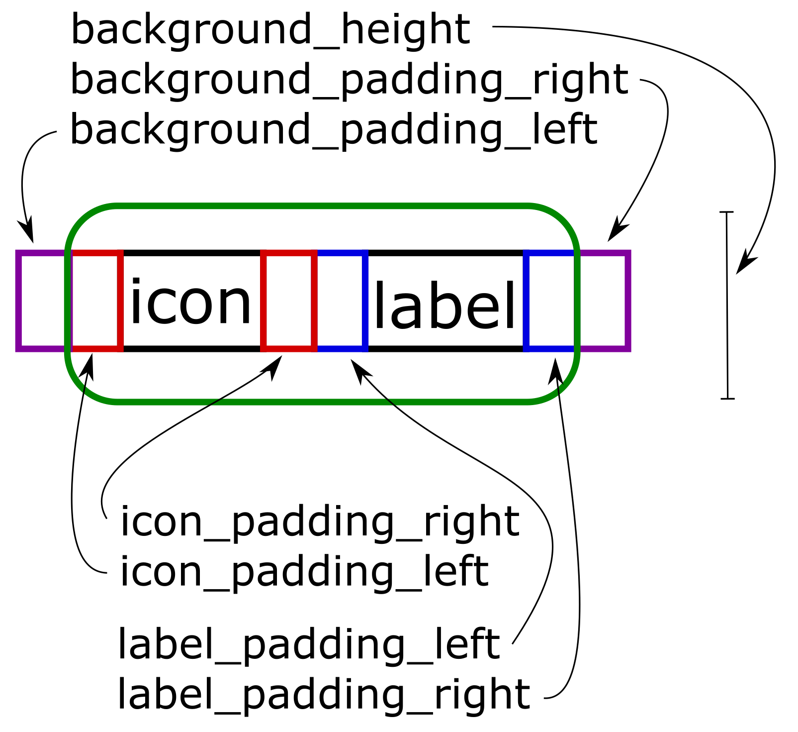

# SketchyBar

This bar project aims to create a highly flexible, customizable and fast statusbar for users that like playing around with
shell scripts and want to make their statusbar show exactly the information they need for their workflow.

The configuration of the bar takes place in a confiuration file where almost everything can be configured.
Bascially, the bar itself is a rectangle that can hold arbitrarily many *items* and *components*, which can be configured to do awesome stuff.
An *item* will occupy a space in the bar and can be equipped to show an *icon* and a *label*. The *icon* and *label* can be changed through
*scripts* that can be attached to the *item*. It is also possible to *subscribe* and *item* to certain *events* for their *script* execution action,
which makes very powerful items possible. Additionally, an *item* can be assigned a *click_script*, which executes on a mouse click.
Furthermore, an *item* can be assigned to mission control spaces or displays, such that they only show on a certain space or display, which makes multi-desktop configuration
of the bar possible and opens the possibility to create individualized bar configuration on a per display and per space level.
These simple ingredients make *items* almost endlessly customizable and can be used to display arbitrary information and perform useful actions. For some examples see my sketchybarrc and
the plugins folder.

Some special features can not be accomplished with a simple *item*, this is where the *components* come into play. They basically are *items* with
extra steps. They contain all the properties a regular item does, but they can do specialized tasks a simple item can not. For example, there
is a *graph* component, which can be used to display graphs in the bar.

For more details on how the configuration works, see the Configuration section below.

This is an example setup (see more example setups [here](https://github.com/FelixKratz/SketchyBar/discussions/47)):

where I have my spaces and a Github indicator on the left. Not shown is the high memory warning which shows the process that is using high system memory on demand.
In the center I have a spotify indicator (only when music is playing) and on the right I have (not shown) a high cpu process indicator, as well as a cpu graph, a new mail counter and the current date.

## Features

* Performance friendly
* No accessibility permissions needed
* As many widgets as you like at any of the three positions: left, center, right
* Associate widgets to certain displays or spaces, to show specific information on the relevant screens/displays
* The widgets are highly customizable with settings for different fonts, colors, icon paddings, label paddings, etc. for each individual element
* Display items from the default menu bar and configure them in sketchybar
* Draw arbitrary graphs in the bar with external data provider scripts that push the data into the graph
* Overlay as many graphs as wanted, like system cpu usage and user cpu usage in one figure
* Individual refresh frequencies for each widget
* Let items subscribe to system events (e.g. space changed, etc.) for their refresh action
* Create custom events and trigger them externaly
* "click" events for the widgets, where a script can be specified to run on a mouse click
* Cache the scripts in RAM to reduce I/O operations
* Offset the bar from its original location, rounded corners and background blur
* Batch configuration messages for easy configuration

Table of Contents
=================

* [SketchyBar](#sketchybar)
* [Table of Contents](#table-of-contents)
   * [Features](#features)
   * [Installation](#installation)
      * [Stable Version](#stable-version)
      * [Development Version](#development-version)
      * [Switching branches and uninstalling](#switching-branches-and-uninstalling)
      * [Plugins and Fonts](#plugins-and-fonts)
   * [Updating](#updating)
   * [Configuration](#configuration)
      * [Note on batching configuration commands](#note-on-batching-configuration-commands)
      * [Global configuration of the bar](#global-configuration-of-the-bar)
      * [Adding a simple menubar item (items will appear in the bar in the order they are added)](#adding-a-simple-menubar-item-items-will-appear-in-the-bar-in-the-order-they-are-added)
      * [Adding a component](#adding-a-component)
      * [Changing the properties of an item](#changing-the-properties-of-an-item)
      * [Changing the default values for all further items](#changing-the-default-values-for-all-further-items)
      * [Subscribing items to system events for their script execution](#subscribing-items-to-system-events-for-their-script-execution)
      * [Creating custom events](#creating-custom-events)
      * [Triggering custom events](#triggering-custom-events)
      * [Supplying data for graphs](#supplying-data-for-graphs)
      * [Forcing all shell scripts to run and the bar to refresh](#forcing-all-shell-scripts-to-run-and-the-bar-to-refresh)
      * [Completely remove an item](#completely-remove-an-item)
      * [Freeze and unfreeze the bar](#freeze-and-unfreeze-the-bar)
   * [Querying](#querying)
      * [Bar Properties](#bar-properties)
      * [Item Properties](#item-properties)
      * [Default Properties](#default-properties)
   * [Scripting](#scripting)
   * [Experimental Features](#experimental-features)
      * [Default Menu Bar Item Alias](#default-menu-bar-item-alias)
      * [Group Items in a Bracket for e.g. colored sections](#group-items-in-a-bracket-for-eg-colored-sections)
   * [Credits](#credits)

## Installation
### Stable Version
```bash
brew tap FelixKratz/formulae
brew install sketchybar
```
Do not forget to copy the example configuration files to your home directory:
```bash
mkdir ~/.config/sketchybar
cp /usr/local/opt/sketchybar/share/sketchybar/examples/sketchybarrc ~/.config/sketchybar/sketchybarrc
mkdir ~/.config/sketchybar/plugins
cp -r /usr/local/opt/sketchybar/share/sketchybar/examples/plugins/ ~/.config/sketchybar/plugins
chmod +x ~/.config/sketchybar/plugins/*
```
and run the bar via
```bash
brew services start sketchybar
```

### Plugins and Fonts
If you want to use your own plugins, make sure that they are referenced in the rc with the correct path and that they are made executable via
```bash
chmod +x name/of/plugin.sh
```
Have a look at the [discussion](https://github.com/FelixKratz/SketchyBar/discussions/12) about plugins and share your own if you want to.
You should of course vet the code from all plugins before executing them to make sure they are not harming your computer.

If you have problems with missing fonts you might need to install the Hack Nerd Font:
```bash
brew tap homebrew/cask-fonts
brew install --cask font-hack-nerd-font
```

## Configuration
Below is a list of all possible commands you can currently use to configure the bar in the configuration file located in *~/.config/sketchybar/sketchybarrc*
or directly from a command line

### Note on batching configuration commands
It is possible to batch commands together into a single call to sketchybar, this can be helpful to
keep the configuration file a bit cleaner and also to reduce startup times.
There always is a *standalone* version of a command and a *batch* version of the same command, with the
difference being, that all *batch* commands can be joined into a single call, for example:
```bash
sketchybar -m bar position top
sketchybar -m add item demo left
sketchybar -m set demo label Hello
sketchybar -m subscribe demo system_woke
```
turns into:
```bash
sketchybar -m batch --bar position=top           \
                    --add item demo left         \
                    --set demo label=Hello       \
                    --subscribe demo system_woke
```
### Global configuration of the bar
```bash
sketchybar -m bar <setting> <value>
```
or when you want to batch configurations:
```bash
sketchybar -m batch --bar <setting>=<value> ... <setting>=<value>
```

where the settings currently are:
* *position*: the position of the bar on the screen, either *top* or *bottom*
* *height*: the height of the bar in points
* *margin*: the screen margin around the bar
* *y_offset*: the y-offset in points from the default position
* *corner_radius*: the corner radius of the bar
* *border_width*: the width of the bars border
* *border_color*: the color of the bars border
* *blur_radius*: the blur radius to be applied to the background of the bar
* *padding_left*: padding on the left before first item 
* *padding_right*: just as padding_right
* *bar_color*: the color of the bar
* *display*: on which display to show bar (*main* or *all*)
* *hidden*: hides and unhides the bar, for hotkey toggling of the bar (*on*, *off*, *toggle*; optional: *<display_number>* or *current*)
* *topmost*: draws sketchybar on top of *everything* (even the default menu bar) (*on*, *off*, *toggle*, default: *off*)
* *font_smoothing*: wheter fonts should be smoothened (*on*, *off*, *toggle*, default: *off*)

### Adding a simple menubar item (items will appear in the bar in the order they are added)
```bash
sketchybar -m add item <name> <position> [optional: <modifier>]
```
or with command batching:
```bash
sketchybar -m batch --add item <name> <position> [optional: <modifier>]
```
where the *name* should not contain whitespaces, it can be used to further configure the item, which is covered later.
The *position* is the placement in the bar and can be either *left*, *right* or *center*.
The list of modifiers for item creation is short currently:
* *nospace*: This item reserves no space in the bar and the next item starts exactly where this item starts (good for stacked widgets)

### Adding a component
```bash
sketchybar -m add component <type> <name> <position> [optional: <modifier>]
```
or for batching of commands:
```bash
sketchybar -m batch --add component <type> <name> <position> [optional: <modifier>]
```
Components are essentially items, but with special properties. 
Currently there are the component *types*: 
* ~~*title*: Showing the current window title,~~ (DEPRECATED, see [this](https://github.com/FelixKratz/SketchyBar/discussions/12#discussioncomment-1215932))
* *graph*: showing a graph,
* *space*: representing a mission control space
* *alias*: a default menu bar item (for details see the experimental section)
* *bracket*: brackets together other items (for details see the experimental section)

### Changing the properties of an item
```bash
sketchybar -m set <name> <property> <value>
```
here batching is also possible with:
```bash
sketchybar -m batch --set <name> <property>=<value> ... <property>=<value>
```
where the *name* is used to target the item with this name.

An item always has the following structure in the bar:  <br>
 <br>
background_padding_left|-icon_padding_left-|-icon-|-icon_padding_right-|-label_padding_left-|-label-|-label_padding_right-|background_padding_right <br>

A list of properties available to the *set* command is listed below:
* *position*: Overrides the position set in the *add* command (*left*, *right*, *center*)
* *associated_space*: on which space to show this item (can be multiple, not specifying anything will show item on all spaces)
* *associated_display*: on which displays to show this item (can be multiple, not specifying anything will show item on all displays)
* *icon*: the icon of the item
* *icon_font*: the font for the icon
* *icon_color*: the color of the icon
* *icon_highlight_color*: the highlight color of the icon (e.g. for active space icon)
* *icon_padding_left*: left padding of icon (default: 0)
* *icon_padding_right*: right padding of icon (default: 0)
* *icon_highlight*: wether the icon is highlighted with the *icon_highlight_color* (values: *on*, *off*, *toggle*, default: *off*)
* *label*: the label of the item
* *label_font*: the font for the label
* *label_color*: the color of the label
* *label_highlight_color*: the highlight color of the label (e.g. for active space icon)
* *label_padding_left*: left padding of label (default: 0)
* *label_padding_right*: right padding of label (default: 0)
* *label_highlight*: wether the label is highlighted with the *label_highlight_color* (values: *on*, *off*, *toggle*, default: *off*)
* *draws_background*: wether the item should draw a background (values: *on*, *off*, *toggle*, default: *off*)
* *background_color*: draws a rectangular background for this item in the given color (this automatically activates *draws_background*)
* *background_height*: the height of the background, the background will always be centered vertically around the center of the item
* *background_border_color*: the color of the backgrounds border
* *background_corner_radius*: the corner radius of the items background (default: 0)
* *background_border_width*: the border width of the items background (default: 0)
* *background_padding_left*: the left padding applied around the background of the item (default: 0)
* *background_padding_right*: the right padding applied around the background of the item (default: 0)
* *width*: overrides the width of the item (useful for items which frequently change in width and thus move all other items) (HEAD only)
* *y_offset*: the vertical offset of this item (default: 0)
* *graph_color*: color of the associated graph
* *graph_fill_color*: optional property to override the automatically calculated fill color of the graph
* *graph_line_width*: sets the line width of the associated graph
* *update_freq*: time in seconds between script executions
* *script*: a script to run every *update_freq* seconds
* *click_script*: script to run when left clicking on item (Note: This is also possible via the *mouse_clicked* event, see #subscribing-items-to-system-events-for-their-script-execution)
* *cache_scripts*: If the scripts should be cached in RAM or read from disc every time (values: *on*, *off*, *toggle*, default: *off*)
* *updates*: If and when the item updates e.g. via script execution (values: *on*, *off*, *toggle*, *when_shown*,  default: *on*)
* *drawing*: If the item should be drawn into the bar (values: *on*, *off*, *toggle*,  default: *on*)
* *lazy*: Changes do not trigger a redraw of the bar, item is refreshed when the bar is redrawn anyways (values: *on*, *off*, *toggle*, default: *off*)

### Changing the default values for all further items
It is possible to change the *defaults* at every point in the configuration. All item created *after* changing the defaults will
inherit these properties from the default item.
```bash
sketchybar -m default <property> <value>
```
batching is again possible via:
```bash
sketchybar -m batch --default <property>=<value> ... <property>=<value>
```
this currently works for the properties:
* *label_font*
* *label_color*
* *label_highlight_color*
* *label_padding_left*
* *label_padding_right*
* *icon_font*
* *icon_color*
* *icon_highlight_color*
* *icon_padding_left*
* *icon_padding_right*
* *draws_background*
* *background_height*
* *background_color*
* *background_border_color*
* *background_corner_radius*
* *background_border_width*
* *y_offset*
* *update_freq*
* *script* (HEAD only)
* *click_script* (HEAD only)
* *cache_scripts*
* *updates*
* *drawing*
* *lazy*

It is also possible to reset the defaults via the command
```bash
sketchybar -m default reset
```

### Subscribing items to system events for their script execution
Any item can *subscribe* to arbitrary *events*, when the *event* happens, all items subscribed to the *event* will execute their *script*.
This can be used to create more reactive and performant items which react to events rather than polling for a change.
```bash
sketchybar -m subscribe <name> <event> ... <event>
```
the batching command is very similar:
```bash
sketchybar -m batch --subscribe <name> <event> ... <event>
```
where the events are:
* *front_app_switched*: when frontmost application changes (not triggered if a different app of the same window is focused)
* *space_change*: when the space is changed
* *display_change*: when the display is changed
* *system_woke*: when the system has awaken from sleep
* *mouse_entered*: when the mouse enters over an item (HEAD only)
* *mouse_exited*: when the mouse leaves an item (HEAD only)
* *mouse_clicked*: when an item is clicked (HEAD only)

HEAD only: <br>
When an item is subscribed to these events the *script* is run and it gets passed the *$SENDER* variable, which holds exactly the above names, to distinguish between the different events.
It is thus possible to have a script that reacts to each event differently e.g. via a switch for the *$SENDER* variable in the *script*. I will soon create an example an link it here.
### Creating custom events
This allows to define events which are triggered by a different application (see Trigger custom events). Items can also subscribe to these events for their script execution.
```bash
sketchybar -m add event <name> [optional: <NSDistributedNotificationName>]
```
and the batch version of this:
```bash
sketchybar -m batch --add event <name> [optional: <NSDistributedNotificationName>]
```
Optional: You can subscribe to the notifications sent to the NSDistributedNotificationCenter e.g.
the notification Spotify sends on track change: "com.spotify.client.PlaybackStateChanged" [example](https://github.com/FelixKratz/SketchyBar/discussions/12#discussioncomment-1455842), or the
notification sent by the system when a bluetooth device connected, or disconnected: *com.apple.bluetooth.state* ([example](https://github.com/FelixKratz/SketchyBar/discussions/12#discussioncomment-1465761))
to create more responsive items.

### Triggering custom events
This triggers a custom event that has been added before
```bash
sketchybar -m trigger <event>
```
This could be used to link the powerful event system of yabai to sketchybar by triggering the custom action via a yabai event.

### Supplying data for graphs
```bash
sketchybar -m push <name> <data>
```
This pushes the data point into the graph with name *name*.

### Forcing all shell scripts to run and the bar to refresh
```bash
sketchybar -m update
```
### Completely remove an item
```bash
sketchybar -m remove item <name>
```
This also works for components, just reference it by name.

### Freeze and unfreeze the bar
```bash
sketchybar -m freeze <on/off>
```
This stops the redrawing of the bar entirely and "freezes" it.

## Querying
*SketchyBar* can be queried for information about a number of things.
### Bar Properties
Information about the bar can be queried via:
```bash
sketchybar -m query bar
```
The output is a json structure containing relevant information about the configuration settings of the bar.
### Item Properties
Information about an item can be queried via:
```bash
sketchybar -m query item <name>
```
The output is a json structure containing relevant information about the configuration of the item.
### Default Properties
Information about the current defaults.
```bash
sketchybar -m query defaults
```
## Scripting
The bar supports scripts where ever possible to make it as customizable and versatile as possible.
When an item invokes a script, the script has access to some environment variables, such as:
```bash
$NAME
$SENDER (HEAD only)
```
Where *$NAME* is the name of the item that has invoked the script and *$SENDER* is the reason why the script is executed ($SENDER only on HEAD).
The space component has additional variables:
```bash
$SELECTED
$SID
$DID
```
where $SELECTED has the value *true* if the associated space is selected and *false* if the selected space is not selected, while
$SID holds the space id and $DID the display id.

By default the space component invokes the script:
```bash
if [ "$SELECTED" = "true" ]; then 
  sketchybar -m set $NAME icon_highlight on 
else 
  sketchybar -m set $NAME icon_highlight off 
fi
```
which you can freely configure to your liking by supplying a different script to the space component.
For performance reasons the space script is only run on change.
I plan on increasing the available environment variables in scripting step by step but if you have a suggestion let me know in the issues.

## Experimental Features
These are highly experimental features that need some work, but are included on HEAD anyways, because they do not interfere with
the rest of the bar.
### Default Menu Bar Item Alias
It is possible to create an alias for default menu bar items (such as MeetingBar, etc.) in sketchybar. This is still a bit janky though so please post the issues you encounter. The default menu bar can be set to autohide and this should still work.

Important: <br>
I highly recommend setting a wallpaper on all spaces that makes the default menu bar items appear in either the light or the dark theme consitently.

It is now possible to create an alias of a default menu bar item with the following syntax:
```bash
sketchybar -m add component alias <application_name> <position>
```
this operation requires screen capture permissions, which should be granted in the system preferences.
This will put the default item into sketchybar. 
Aliases currently are not clickable but can be modified with all the options available for simple items.

The command can be overloaded by providing a *window_owner* and a *window_name*
```bash
sketchybar -m add component alias <window_owner>,<window_name> <position>
```
this way the default system items can also be slurped into sketchybar, e.g.:

Owner: Control Center, Name: Bluetooth <br>
Owner: Control Center, Name: WiFi <br>
Owner: Control Center Name: Sound
Owner: Control Center, Name: UserSwitcher <br>
Owner: TextInputSwitcher, Name: Keyboard Input <br>
Owner: SystemUIServer, Name: AppleTimeMachineExtra <br>

Or the individual widgets of [Stats](https://github.com/exelban/stats):<br>
Owner: Stats Name: CPU_Mini<br>
Owner: Stats Name: RAM_Mini<br>
Owner: Stats Name: Network_Speed<br>
etc...<br>

All further default menu items currently available on your system can be found via the command:
```bash
sketchybar -m query default_menu_items
```
### Group Items in a Bracket for e.g. colored sections
This feature is only on HEAD currently.

It is possible to bracket together items via the command (see [this](https://github.com/FelixKratz/SketchyBar/discussions/12#discussioncomment-1455842) discussion for an example):
```bash 
sketchybar -m add component bracket <name> <first item name> ... <n-th item name>
```
or with batching 
```bash 
sketchybar -m batch --add component bracket <name> <first item name> ... <n-th item name>
```
The first item must always be the one listed earliest in the config. It is now possible to 
set properties for the bracket, just as for any item or component. Brackets currently only support all background features.
E.g., if I wanted a colored background around *all* my space components (which are named *code*, *writing*, *reading* and *entertainment*) I would set it up like this:
```bash 
sketchybar -m batch --add       component bracket  primary_spaces code writing reading entertainment                   \
                                                                                                                       \
                    --set       primary_spaces     background_color=0xffffffff                                         \
                                                   background_corner_radius=4                                          \
                                                   background_height=20
```
this draws a white background below all my space components. I plan to expand the capability of item brackets significantly in the future.

## Credits
This project was forked from *[spacebar](https://github.com/cmacrae/spacebar)* and completely reimagined and rewritten. <br>
The original idea is based on the status bar that was included in *[yabai](https://github.com/koekeishiya/yabai)* before getting removed.
